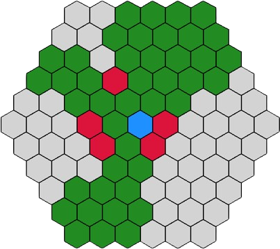
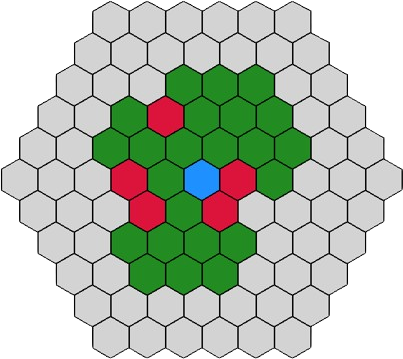
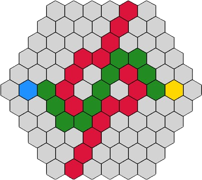
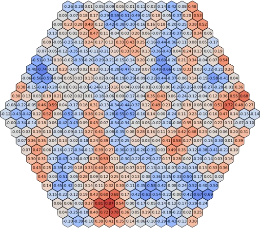

# Layout Feature

This module contains the layout logic for creating and managing hexagonal grids. The layout is implemented using a `HashMap` structure, facilitating the creation and manipulation of hexagonal grids.

## Why Use `HexLayout`?

`HexLayout` is designed to offer several advanced features for working with hexagonal grids, including:

- **Field of View (FOV)**: Determine which positions are visible from a given position, taking into account obstacles and range limitations.
- **Pathfinding**: Compute the shortest path between two positions using algorithms suited for hexagonal grids.
- **Movement Fields**: Calculate which positions are reachable within a specified range from a starting position.
- **Noise Maps**: Generate and manipulate noise-based data for procedural content or simulations.
- **Logical operations**: Perform logical operations on multiple hexagonal grids, such as the logical AND, OR, and NOT operations.

## Layout Design for Storing Elements in Video Game Maps

The layout described here is designed to efficiently organize elements within video game maps, allowing for structured storage across multiple levels. Below are some examples of how this can be applied to different types of elements:

### 1. **Walls (or Obstacles)**
A specific layout for walls can be used to manage information related to pathfinding, Field of View (FOV), and Field of Movement (FOM). This enables quick calculations for character pathing and determines which areas are visible or accessible based on obstacles.

### 2. **Biomes**
Another layout could be utilized for biomes, using `f64` (64-bit floating-point) values to handle parameters such as terrain variations generated by procedural noise. This allows for the creation of diverse and dynamic environments by adjusting terrain generation parameters for each biome.

### 3. **Players**
A distinct layout for players would store specific information such as position, health status, inventory, and other key gameplay attributes. This facilitates the management of player interactions with the game world and tracks their progression.

This modular and hierarchical structure optimizes data management within video game maps, making it easier to access relevant information for each element type according to the game's needs.

## Examples

### Basic Usage

Here's a simple example of creating a `HexLayout`, accessing, modifying, and deleting data:

```rust
use hexing::{layout::HexLayout, HexPosition};

let mut map = HexLayout::new_from_range(1, HexPosition(0, 0));
assert_eq!(map.len(), 1);

// Access data
map.get(HexPosition(0, 0));

// Modify data
map.set(HexPosition(0, 0), 10.0);

// Create new data
map.set(HexPosition(1, 0), 10.0);
map.delete(HexPosition(1, 0));
assert_eq!(map.get(HexPosition(1, 0)), Some(&10.0));

// Delete data
map.delete(HexPosition(0, 0));
assert!(map.is_empty());
```

### Advanced Usage

when you create a `HexLayout`, you can use the following advanced features if the data associated with a `HexPosition` is a `bool` value (`HexLayout<bool, _>`) in order to represent whether the position is blocked or not:

- Pathfinding
- Movement Fields
- Field of View

where a true value indicates that the position is blocked, and a false value indicates that the position is unblocked.

- **Field of View (FOV)**

The field of view (FOV) feature allows for the calculation of which positions are visible from a given position, taking into account obstacles and range limitations.

```rust
use hexing::{layout::HexLayout, HexPosition};

let mut map = HexLayout::new_from_range(6, HexPosition(0, 0));
    
let start_pos = HexPosition::new(0, 0);
    
map.set(HexPosition(0, 1), true);
map.set(HexPosition(1, 0), true);
map.set(HexPosition(-2, 0), true);
map.set(HexPosition(-2, 1), true);
map.set(HexPosition(0, -2), true);
    
let reachable_positions = map.field_of_view(start_pos, None);
    
let range = 2;
let reachable_positions_with_range = map.field_of_view(start_pos, Some(range));
    
for pos in reachable_positions {
   println!("{}", pos);
}
    
for pos in reachable_positions_with_range {
    println!("{}", pos);
}
```

a simple image to illustrate the output of the above code:



**Field of Movement (FOM)**

The field of movement (FOM) feature allows for the calculation of which positions are reachable from a given position within a specified range.

```rust
use hexing::{layout::HexLayout, HexPosition};

let mut map = HexLayout::new_from_range(3, HexPosition(0, 0));

let start_pos = HexPosition::new(0, 0);
let range = 2;

let reachable_positions = map.field_of_move(start_pos, range);
assert_eq!(reachable_positions.len(), 19);

map.set(HexPosition(0, 1), true);
map.set(HexPosition(1, 0), true);
map.set(HexPosition(0, -2), true);

let reachable_positions = map.field_of_move(start_pos, range);
assert_eq!(reachable_positions.len(), 13);

for pos in reachable_positions {
   println!("{},", pos);
}
```

a simple image to illustrate the output of the above code:



**Pahfinding**

The pathfinding feature allows for the calculation of the shortest path between two positions using algorithms suited for hexagonal grids.

```rust
use hexing::{layout::HexLayout, HexPosition};

let mut map: HexLayout<bool, isize> = HexLayout::new_from_range(3, HexPosition(0, 0));

map.set(HexPosition(-1, 1), true);
map.set(HexPosition(1, -1), true);
map.set(HexPosition(1, 0), true);
map.set(HexPosition(0, 1), true);

let start = HexPosition(0, 0);
let goal = HexPosition(0, 2);

let path = map.pathfinding(start, goal);

for pos in &path {
    println!("Position: {:?}", pos);
}

assert_eq!(path, vec![HexPosition(0, 0), HexPosition(-1, 0), HexPosition(-2, 1), HexPosition(-2, 2), HexPosition(-1, 2), HexPosition(0, 2)]);
```

a simple image to illustrate the output of the above code:



## Noise Features

Additionaly, the `HexLayout` supports noise features.

```bash
cargo add hexing --features=noise
cargo add noise
```

or manually add it to your `Cargo.toml`:

```toml
[dependencies]
hexing = { version = "0.3.1", features = ["noise"] }
noise = "0.8.1"
```

and use the `HexLayout` with the `noise` feature:

> [!IMPORTANT]
> In order to use the `noise` feature, you need init a `HexLayout` as `HexLayout<f64, _>`.

```rust
use hexing::{layout::HexLayout, HexPosition};
use noise::{Fbm, MultiFractal, Perlin};

let fbm = Fbm::<Perlin>::new(12345)
    .set_octaves(2)
    .set_frequency(0.2)
    .set_lacunarity(0.4)
    .set_persistence(0.5);

let mut map = HexLayout::new_from_range(1, HexPosition(0, 0));
map.init_noise(fbm);

for pos in map.positions() {
    assert!(*map.get(*pos).unwrap() > -1.0 && *map.get(*pos).unwrap() < 1.0);

    println!("{},", *map.get(*pos).unwrap());
}
```

a simple image to illustrate the output of the above code:


